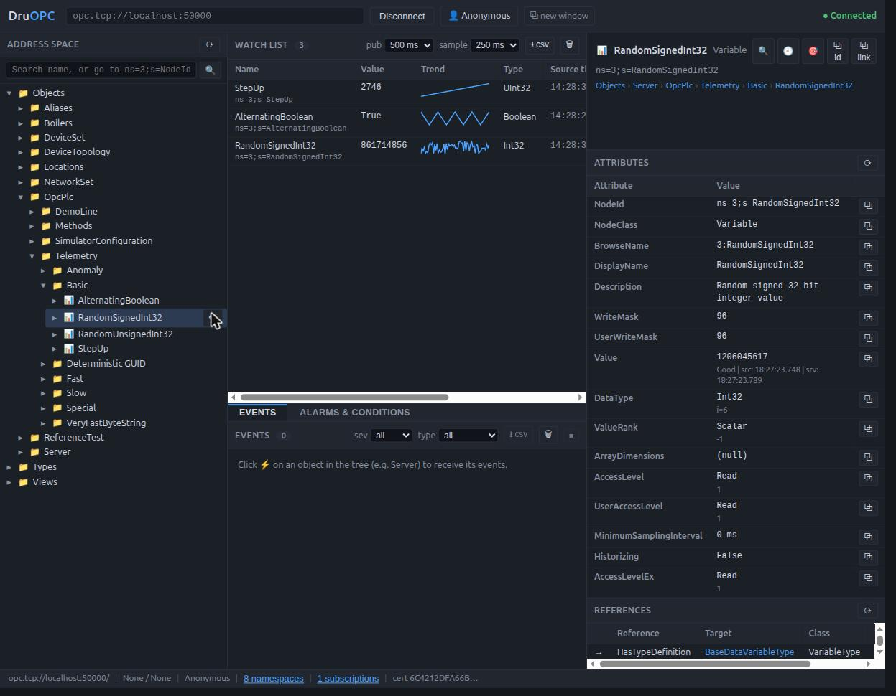

# DruOPC

[](https://github.com/drusteeby/DruOPC/actions/workflows/pr.yml)
[](https://github.com/drusteeby/DruOPC/releases)
[](LICENSE.md)
[](https://buymeacoffee.com/drusteeby)



**DruOPC** is a two-piece toolkit for learning, testing and demonstrating
OPC UA:

- **DruOPC Simulator** (`src/`) — an OPC UA server that behaves like a PLC:
  changing values, anomalies, boilers, events, alarms, methods, and your own
  nodes from a JSON file. Everything is configured through `appsettings.json` —
  no command-line flags.
- **DruOPC Browser** (`browser/`) — a web-based OPC UA client for browsing and
  inspecting *any* OPC UA server: live watch lists, writes, methods, events,
  alarms with acknowledge, history, UDT decoding, shareable deep links.

They work great together (the browser connects to the simulator out of the box)
and separately (point the browser at a real PLC; point any OPC UA client at the
simulator).

Want to help? See **[CONTRIBUTING.md](CONTRIBUTING.md)** — bug reports, docs
fixes and pull requests are all welcome. If DruOPC saves you a license dongle
hunt, you can [buy me a coffee](https://buymeacoffee.com/drusteeby). ☕

> This is a fork of
> [Azure-Samples/iot-edge-opc-plc](https://github.com/Azure-Samples/iot-edge-opc-plc)
> with breaking changes: the command-line interface was replaced by
> `appsettings.json` configuration, the host was rebuilt on the .NET generic
> host, and DruOPC was added. The upstream Docker images on MCR do **not**
> match this fork.

## Quick start

### Docker

```console
git clone https://github.com/drusteeby/DruOPC.git
cd DruOPC
docker compose up
```

Open <http://localhost:5080> and connect to `opc.tcp://simulator:50000`.

### From source

Prerequisite: [.NET SDK](https://dotnet.microsoft.com/download) 10 or later.

```console
git clone https://github.com/drusteeby/DruOPC.git
cd DruOPC

# terminal 1 — the simulated PLC (OPC UA server on opc.tcp://localhost:50000)
dotnet run --project src

# terminal 2 — DruOPC (web client on http://localhost:5080)
dotnet run --project browser
```

Open <http://localhost:5080>, click **Connect**, trust the certificate — you are
browsing live data.

**New to OPC UA?** The **[getting started guide](docs/getting-started.md)** walks
through all of this step by step, explains the OPC UA concepts as you go, and ends
with you writing values and acknowledging alarms.

## Documentation

| Document | What it covers |
|---|---|
| [Getting started](docs/getting-started.md) | Zero to a live connection in 15 minutes; OPC UA primer; connecting to real PLCs |
| [DruOPC user manual](docs/user-manual.md) | Every DruOPC feature, troubleshooting table, OPC UA glossary |
| [Configuration reference](#configuration) | Every simulator setting (below) |
| [Deterministic alarms](deterministic-alarms.md) | Scripted alarm sequences for repeatable client testing |

## DruOPC in brief

- Endpoint discovery, security-mode selection, anonymous / username / X509 login
- Per-certificate trust dialog (trust once / permanently); auto-accept off by default
- Address-space tree with search, NodeId jump, breadcrumbs and reveal-in-tree
- Full attribute + reference inspection with copy buttons
- Live watch list: subscriptions, sparkline trends, inline typed writes, CSV export
- Events with server-side severity/type filters; CSV export
- Alarms & conditions: live retained-condition list, ConditionRefresh, acknowledge
- Raw history read with chart, table and CSV (browser-timezone aware)
- Method calls with typed argument forms
- Value inspector: full values, structures/UDTs as expandable JSON trees
- Namespace table and subscription inspector
- Shareable deep links (`?endpoint=…&node=…`); per-browser-tab isolated sessions

See the [user manual](docs/user-manual.md) for how to use each of these.

## Simulator features

The address space contains, by default:

- An alternating boolean, random signed/unsigned 32-bit integers
- Sine waves with spike and dip anomalies, positive and negative trends
- Values cycling good/bad/uncertain status (slow: 10 s, fast: 1 s)
- Configurable **slow** (10 s) and **fast** (1 s) changing nodes of several types
- **Boiler #1**: a complex-type (UDT) boiler status with heater on/off methods
- **Boiler #2**: a Device Information (DI) companion-spec boiler with
  DeviceHealth states and maintenance/overheat events
- A GUID-identified node set, long strings (10–200 kB), special characters in
  names, opaque and long NodeIds, and the OPC Foundation reference test nodes
- A working-set memory node under `OpcPlc/Telemetry/Special/WorkingSetMB`

Enabled through configuration (see [reference](#configuration)):

- **Simple events** (`Simulation:AddSimpleEventsSimulation`) — the OPC Foundation
  SimpleEvents quickstart model, emitting a `SystemCycleStartedEventType` every 3 s
- **Alarms & conditions** (`Simulation:AddAlarmSimulation`) — the OPC Foundation
  AlarmCondition quickstart: areas (Green/Yellow…) with motor/tank sources raising
  Trip, Deviation, Level and Dialog conditions on a deterministic heartbeat, with
  working Acknowledge/Confirm/Comment
- **Deterministic alarms** (`Simulation:DeterministicAlarmSimulationFile`) —
  script-driven alarm sequences ([details](deterministic-alarms.md))
- **Event bursts** (`Simulation:EventInstanceCount` / `EventInstanceRate`)
- **User-defined nodes** from a JSON file ([below](#user-defined-nodes-nodesfile))
- **NodeSet2 / uanodes model files** (`NodeSet2Files`, `UaNodesFiles`)
- **Chaos mode** (`RunInChaosMode`) — randomly injects errors, closes sessions
  and subscriptions; use it to test client resiliency
- **Tag writer** (`TagWriter`) — replays a station-data handshake against the
  nodes from the bundled `nodesfile.json` (demo of externally-driven values)

### OPC UA methods

| Method (under `OpcPlc/Methods`) | Description |
| ------------------------------- | ----------- |
| ResetTrend | Reset trend values to their baseline |
| ResetStepUp / StopStepUp / StartStepUp | Control the StepUp counter |
| StopUpdateSlowNodes / StartUpdateSlowNodes | Pause/resume slow node updates |
| StopUpdateFastNodes / StartUpdateFastNodes | Pause/resume fast node updates |
| HeaterOn / HeaterOff | Boiler #1 heater control |

You can call all of these from DruOPC's method dialog.

### Update limits

To freeze or limit simulation updates at runtime, write to the
`SlowNumberOfUpdates` / `FastNumberOfUpdates` nodes in
`OpcPlc/SimulatorConfiguration`: `< 0` = update forever (default), `0` = stop,
`> 0` = update that many more times.

## Configuration

All simulator settings live in [`src/appsettings.json`](src/appsettings.json)
under the `OpcPlc` section. Edit the file, or override any setting without
touching it:

- **Environment variables** — replace `:` with `__` (double underscore):

  ```console
  # Linux/macOS
  OpcPlc__Simulation__AddAlarmSimulation=true OpcPlc__OpcUa__ServerPort=51000 dotnet run --project src

  # Windows PowerShell (the variable persists for the terminal session;
  # unset with: $env:OpcPlc__Simulation__AddAlarmSimulation=$null)
  $env:OpcPlc__Simulation__AddAlarmSimulation="true"; dotnet run --project src
  ```

- **An `appsettings.Production.json`** (or any `ASPNETCORE_ENVIRONMENT`) file
  layered over the defaults — standard .NET configuration behavior.

Invalid values (for example a zero node rate) are rejected at startup with a
clear message rather than misbehaving silently.

### Setting reference

Keys are relative to the `OpcPlc` section, so `OpcUa:ServerPort` means
`OpcPlc:OpcUa:ServerPort` (env var `OpcPlc__OpcUa__ServerPort`).

**Server basics**

| Key | Default | Meaning |
|---|---|---|
| `OpcUa:ServerPort` | `50000` | OPC UA endpoint port (`opc.tcp://<host>:<port>`) |
| `OpcUa:ServerPath` | `""` | Optional URL path suffix for the endpoint |
| `OpcUa:Hostname` | machine name (shipped config sets `localhost`) | Hostname used in the endpoint and certificate |
| `OpcUa:EnableUnsecureTransport` | `true` | Also offer a SecurityMode=None endpoint (handy for dev; disable in production) |
| `OpcUa:MaxSessionCount` / `MaxSubscriptionCount` / `MaxQueuedRequestCount` | `100` / `100` / `2000` | Server limits |
| `OpcUa:MaxSessionTimeout` | `3600000` | Session idle timeout (ms) |
| `OpcUa:OpcMaxStringLength` | `1048576` | Max transferable string length |
| `OpcUa:LdsRegistrationInterval` | `0` | Registration interval in ms with an OPC UA Local Discovery Server, if you run one (0 = off) |
| `WebServerPort` | `8080` | HTTP port serving the `pn.json` file (a ready-made node list for Microsoft's *OPC Publisher* edge module; ignore if you don't use it) |
| `ShowPublisherConfigJsonIp` / `ShowPublisherConfigJsonPh` | `true` / `false` | Write/log `pn.json` using IP / hostname as EndpointUrl |
| `PnJson` | `pn.json` | Name of the OPC Publisher file |
| `LogLevelCli` | `info` | Log level (`critical`…`trace`) |
| `RunInChaosMode` | `false` | Randomly inject errors/close sessions to test clients |

**Security & authentication**

| Key | Default | Meaning |
|---|---|---|
| `OpcUa:AutoAcceptCerts` | `true` | Trust any client certificate (dev convenience — turn off for real use) |
| `OpcUa:TrustMyself` | `true` | Put the server's own cert into its trusted store |
| `OpcUa:OpcOwnCertStoreType` | `Directory` | `Directory`, `X509Store` (Windows cert store) or `FlatDirectory` (Kubernetes-style flat PKI folder) |
| `OpcUa:OpcOwnCertStorePath` / `OpcTrustedCertStorePath` / `OpcRejectedCertStorePath` / `OpcIssuerCertStorePath` | `pki/...` | Certificate store locations |
| `OpcUa:DnsNames` | `[]` | Extra DNS names/IPs added to the server certificate |
| `OpcUa:DontRejectUnknownRevocationStatus` | `true` | Accept CA certs whose CRL/OCSP is unreachable |
| `DisableAnonymousAuth` | `false` | Require a login |
| `DisableUsernamePasswordAuth` | `false` | Disallow username/password logins |
| `DisableCertAuth` | `false` | Disallow X509 user-certificate logins |
| `AdminUser` / `AdminPassword` | `sysadmin` / `demo` | Admin login (change these!) |
| `DefaultUser` / `DefaultPassword` | `user1` / `password` | Standard login (change these!) |

Trusted *user* certificates and issuer chains can be provisioned via
`OpcUa:TrustedUserCertificateFileNames` / `...Base64Strings` and the
corresponding `UserIssuer` keys, or by dropping `.der`/`.crt` files into
`pki/trusted-user/certs`.

**Simulation**

| Key | Default | Meaning |
|---|---|---|
| `Simulation:SimulationCycleCount` / `SimulationCycleLength` | `50` / `100` | Cycles per phase / cycle length in ms |
| `Simulation:AddAlarmSimulation` | `false` | Alarms & conditions model |
| `Simulation:AddSimpleEventsSimulation` | `false` | SimpleEvents model |
| `Simulation:AddReferenceTestSimulation` | `true` | OPC Foundation reference test nodes |
| `Simulation:DeterministicAlarmSimulationFile` | `null` | Path to a deterministic alarm script |
| `Simulation:EventInstanceCount` / `EventInstanceRate` | `0` / `1000` | Burst events: count per cycle / rate in ms |
| `DataGeneration:NoDataValues` / `NoDips` / `NoSpikes` / `NoPosTrend` / `NoNegTrend` | `false` | Disable individual data simulations |
| `SlowNodes:NodeCount` / `NodeRate` / `NodeType` | `1` / `10` (s) / `UInt` | Slow-changing nodes (`UInt`, `Double`, `Bool`, `UIntArray`) |
| `SlowNodes:NodeMinValue` / `NodeMaxValue` / `NodeStepSize` / `NodeRandomization` | type min/max, `1`, `false` | Value shaping |
| `FastNodes:*` | count `1`, rate `1` s | Same options as SlowNodes, faster |
| `VeryFastByteStringNodes:NodeCount` / `NodeSize` / `NodeRate` | `1` / `1024` B / `1000` ms | Large ByteString churn |
| `GuidNodes:NodeCount` | `1` | Nodes with deterministic GUID ids |
| `Boiler2:TemperatureSpeed` / `BaseTemperature` / `TargetTemperature` / `MaintenanceInterval` / `OverheatInterval` | `1`, `10`, `80`, `300` s, `120` s | Boiler #2 behavior |
| `NodesFile` | `nodesfile.json` | User-defined nodes file ([below](#user-defined-nodes-nodesfile)) |
| `UaNodesFiles` / `NodeSet2Files` | `[]` | Compiled `.uanodes` / `NodeSet2.xml` model files to load |
| `TagWriter:Enabled` | `true` | Station-data handshake demo against the bundled nodes file |

Slow/fast node **data types**: `UInt` counts up by 1, `Double` by 0.1, `Bool`
alternates, `UIntArray` is 32 counting values.

## User-defined nodes (NodesFile)

Set `OpcPlc:NodesFile` to a JSON file describing your own nodes. They appear
under the `OpcPlc` folder, are readable/writable by any client, and are *not*
simulated — they hold whatever a client last wrote (unless the
[TagWriter](#configuration) drives them).

```json
{
  "Folder": "MyTelemetry",
  "FolderList": [
    { "Folder": "Line1", "NodeList": [ { "NodeId": "ChildNode" } ] }
  ],
  "NodeList": [
    { "NodeId": 1023, "Name": "ActualSpeed", "Description": "Rotational speed" },
    {
      "NodeId": "DKW",
      "DataType": "Float",
      "ValueRank": -1,
      "AccessLevel": "CurrentReadOrWrite",
      "Description": "Diagnostic characteristic value"
    }
  ]
}
```

- `NodeId` (required): numeric, string or GUID identifier.
- `Name`, `Description` (optional): default to the NodeId.
- `DataType`: any OPC UA built-in type name; defaults to `Int32`.
- `ValueRank`: `-1` scalar (default), `1` one-dimensional array.
- `AccessLevel`: e.g. `CurrentRead`, `CurrentReadOrWrite` (default).
- `NamespaceIndex` or `Namespace` (optional): place the node in a specific
  namespace.
- `FolderList` nests folders recursively.

The bundled [`src/nodesfile.json`](src/nodesfile.json) models a four-station
demo line (`DemoLine/Station10` … `Station40`); the TagWriter service animates
Station10's handshake tags.

## Running in Docker

Every release publishes container images to GitHub Container Registry. The
easiest way to run the whole toolkit:

```console
curl -O https://raw.githubusercontent.com/drusteeby/DruOPC/main/compose.yaml
docker compose up
```

Then open <http://localhost:5080> and connect to `opc.tcp://simulator:50000`
(the simulator's name on the compose network).

Or run the pieces individually:

```console
# The simulator (OPC UA on 50000)
docker run --rm -it -p 50000:50000 -p 8080:8080 \
  -e OpcPlc__Simulation__AddAlarmSimulation=true \
  -v druopc-pki:/app/pki \
  ghcr.io/drusteeby/druopc-simulator:latest

# The browser (web UI on http://localhost:5080)
docker run --rm -it -p 5080:8080 ghcr.io/drusteeby/druopc-browser:latest
```

Any `OpcPlc__*` environment variable from the
[configuration reference](#configuration) works with `-e`; mounting `/app/pki`
keeps the server certificate stable across restarts. To build an image locally
instead of pulling, the SDK does it without a Dockerfile:
`dotnet publish src -c Release /t:PublishContainer`.

## Deploying to a cloud

> All cloud deploys pull the public container images from GHCR.

**Azure** — one click, runs both apps in a Container Instances group and
outputs the OPC UA endpoint and browser URL:

[](https://portal.azure.com/#create/Microsoft.Template/uri/https%3A%2F%2Fraw.githubusercontent.com%2Fdrusteeby%2FDruOPC%2Fmain%2Ftools%2Ftemplates%2Fazuredeploy.druopc.json)

**AWS** — CloudFormation template running both apps on a single EC2 instance:
download [`tools/templates/aws-druopc.cfn.yaml`](tools/templates/aws-druopc.cfn.yaml),
then in the CloudFormation console choose *Create stack → Upload a template
file*. Tighten the `AllowedCidr` parameter to your own IP.

**Google Cloud** — Cloud Run only serves HTTP, so it fits the browser but not
the simulator's raw `opc.tcp` port:

```console
gcloud run deploy druopc-browser --image ghcr.io/drusteeby/druopc-browser:latest \
  --port 8080 --allow-unauthenticated --region us-central1
```

For the simulator on GCP, use a Compute Engine VM with the
[compose file](compose.yaml), same as any other Linux host.

**Public demo instance** — [`deploy/demo/compose.yaml`](deploy/demo/compose.yaml)
is a hardened variant (non-default passwords required, resource limits, alarms
enabled) for hosting a shared "try it live" instance on any Docker host.

## Installing from package managers

One-line install on Linux and macOS — detects your OS and picks the snap or
the release binaries (see the
[getting started guide](docs/getting-started.md#installing-without-building)
for details and the manual steps):

```console
curl -fsSL https://raw.githubusercontent.com/drusteeby/DruOPC/main/install.sh | sh
```

- **Snap (Linux)**: `sudo snap install druopc`, then `druopc.simulator` and
  `druopc.browser`.
- **NuGet**: the `DruOPC.Simulator` package lets you embed the simulator in
  your own test projects (see [Testing](#testing)).
- Windows and macOS: download the self-contained archives from the
  [releases page](https://github.com/drusteeby/DruOPC/releases) — no .NET
  install required.

## Testing

```console
dotnet test tests
```

The integration suite (74 tests) starts a real server on an ephemeral port per
fixture and exercises it with a real OPC UA client — including alarm
acknowledge round-trips.

For your own projects, the build produces a NuGet package so you can embed the
simulator in unit tests; see [`tests/PlcSimulatorFixture.cs`](tests/PlcSimulatorFixture.cs) for how to host the simulator inside your own test project.

## Repository layout

| Path | Contents |
|---|---|
| `src/` | The OPC PLC simulator (ASP.NET Core generic host) |
| `browser/` | DruOPC, the web OPC UA client (Blazor Server) |
| `tests/` | Integration tests |
| `docs/` | [Getting started](docs/getting-started.md), [user manual](docs/user-manual.md) |

## Disclaimer

The simulator is a development and test tool. It ships with well-known default
passwords and permissive certificate handling; do not expose it to untrusted
networks in that state. DruOPC performs live writes and method calls on
whatever server it is pointed at — use appropriate care on production systems.

## Resources

- [OPC Foundation UA .NET Standard stack](https://github.com/OPCFoundation/UA-.NETStandard)
- [Upstream project (Azure-Samples/iot-edge-opc-plc)](https://github.com/Azure-Samples/iot-edge-opc-plc)
